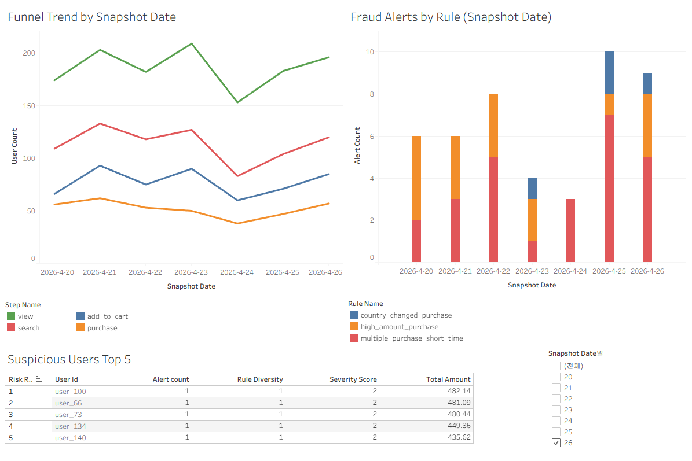

# E-commerce Funnel & Fraud Monitoring Pipeline

Kafka, Spark Structured Streaming, Parquet, SQL, Tableau를 사용해 이커머스 이벤트 데이터를 수집·정제·집계하고, Funnel 분석과 Rule-based Fraud Alert를 생성하는 데이터 엔지니어링 프로젝트입니다.

## 1. Problem
이커머스 서비스에서는 사용자 행동 로그가 쌓여도, 실제로는 다음 문제가 자주 발생합니다.

- 구매 전환율이 어느 단계에서 떨어지는지 파악하기 어렵다
- 결제 이상 징후를 빠르게 식별하기 어렵다
- 원본 로그와 정제 데이터, 분석용 마트를 분리하지 않으면 재처리와 운영이 불편하다

이 프로젝트에서는 이러한 문제를 해결하기 위해 Bronze / Silver / Gold 계층의 데이터 파이프라인을 직접 구현했습니다.

## 2. Architecture
```text
Local Event Generator
    ↓
Kafka
    ↓
Spark Structured Streaming
    ↓
Bronze (Parquet)
    ↓
Silver (Parquet)
    ↓
Gold Mart
    ├── mart_funnel_stats
    └── mart_fraud_alerts
    ↓
DuckDB SQL Analysis
    ↓
Tableau Dashboard
```

## 3. Tech Stack
- Python
- Kafka
- PySpark Structured Streaming
- Parquet
- DuckDB
- Tableau
- Docker

## 4. Data Layers

### Bronze
- raw_events
- Kafka에서 수집한 원본 JSON과 topic / partition / offset / kafka_timestamp 저장

### Silver
- clean_events
- JSON 파싱
- timestamp 변환
- null/유효성 필터
- event_id 기준 중복 제거

### Gold
- mart_funnel_stats
- mart_fraud_alerts

## 5. Funnel Definition
- view
- search
- add_to_cart
- purchase

현재 Funnel은 snapshot 기준 단계별 user_count 비교 방식으로 구현했습니다.

## 6. Fraud Rules
- multiple_purchase_short_time
- high_amount_purchase
- country_changed_purchase

현재 기준:
- SHORT_TIME_SEC = 300
- HIGH_AMOUNT_THRESHOLD = 480.0

## 7. Execution Strategy
로컬 Docker 환경에서 Kafka topic persistence와 Spark checkpoint mismatch 이슈가 발생해, 다음과 같은 run-based execution 방식을 사용했습니다.
     
- 각 실행 세션은 RUN_ID 단위로 분리
- 결과는 `data/runs/<RUN_ID>/...` 경로에 저장
- 여러 run 결과를 `snapshot_date` 기준으로 export해 Tableau에서 추세처럼 비교

## 8. How to Run

### 1) Kafka 실행
```bash
docker compose up -d
```
### 2) RUN ID 지정
```bash
export RUN_ID=20260426_03
```

### 3) Bronze 적재 시작
```bash
spark-submit --packages org.apache.spark:spark-sql-kafka-0-10_2.12:3.5.7 spark_stream.py
```

### 4) Generator 실행
```bash
python generator.py
```

### 5) Silver / Gold 생성
```bash
spark-submit silver_transform.py
spark-submit funnel_mart.py
spark-submit fraud_mart.py
```
### 6) SQL 검증
```bash
python sql_analysis.py
python compare_fraud_volume.py
```
### 7) Tableau export
```bash
export START_SNAPSHOT_DATE=2026-04-20
python export_tableau_runs.py
```
## 9. SQL Validation
Gold Mart 결과는 DuckDB로 Parquet를 직접 조회하는 방식으로 검증했습니다.

주요 확인 항목:

- Funnel 단계별 user count
- Fraud rule별 alert 수
- Suspicious Users Top 5
- Purchase 대비 alert 비율 (alerted_purchase_pct)

Fraud 적정성은 단순 alert row 수보다 아래 지표를 기준으로 판단했습니다.

- purchase_count
- alert_count
- alerted_purchase_count
- alerted_users
- alerted_purchase_pct

## 10. Dashboard
최종 Tableau 대시보드는 아래 3개 시트로 구성했습니다.

- Funnel Trend by Snapshot Date
- Fraud Alerts by Rule (Snapshot Date)
- Suspicious Users Top 5

여러 run 결과를 snapshot_date 기준으로 정렬해 추세 형태로 시각화했습니다.

### Dashboard Preview


## 11. Key Results
- Kafka → Spark → Bronze / Silver / Gold 파이프라인 구현
- Funnel 단계별 user count 및 전환 흐름 시각화
- Rule-based fraud alert mart 생성
- DuckDB SQL 검증 및 Tableau 대시보드 구성
- RUN_ID 기반 실행 구조로 결과 재현성과 보관성 확보

## 12. Troubleshooting

### 1) Spark checkpoint / offset mismatch
- 문제: 재실행 시 Kafka offset과 checkpoint 불일치로 query가 자주 종료됨
- 조치:
    startingOffsets = "latest"
    failOnDataLoss = "false"
    RUN_ID 기반 경로 분리
- 배운 점: 로컬 개발 환경에서는 안정적인 checkpoint 저장소 대신 run isolation이 더 현실적일 수 있다.

### 2) Funnel 전환율이 비현실적으로 높음
- 문제: 초기 generator에서는 퍼널 전환율이 지나치게 높게 계산됨
- 원인: 이벤트 타입을 단순 랜덤 생성하면 대부분의 유저가 여러 이벤트를 모두 경험함
- 조치:
    session 기반 이벤트 흐름으로 변경
    user pool 확대
- 배운 점: 입력 데이터 생성 방식이 결과 해석에 큰 영향을 준다.
### 3) country_changed_purchase 과탐지
- 문제: 국가 변경 결제 alert가 과도하게 발생함
- 원인: generator 재실행 시 user별 기본 country가 랜덤으로 다시 배정됨
- 조치:
    get_base_country(user_id)로 user별 base country 고정
    anomaly injection 확률 조정
- 배운 점: fraud rule 문제처럼 보여도 실제 원인은 데이터 생성 로직일 수 있다.

### 4) Tableau 시각화 혼선
- 문제: 여러 측정값을 한 시트에 섞어 올리면서 표와 차트가 읽기 어려워짐
- 조치:
    Funnel / Fraud / Suspicious Users를 각각 별도 시트로 분리
    마지막에 Dashboard로 조합
- 배운 점: 시각화는 “한 시트 = 한 목적” 원칙이 중요하다.

## 13. Limitations & Next Steos
- 실제 운영 환경 수준의 Kafka persistence 문제는 완전히 해결하지 못함
- run-based 구조로 재현성과 결과 보관을 우선함
- Funnel은 session strict path가 아니라 snapshot 기준 단계별 집계임
- 향후 개선:
    session-based funnel
    S3 기반 checkpoint / storage
    alert explanation 자동 생성

## 14. What I Learned
- 원본 로그 / 정제 데이터 / 분석 마트를 계층별로 분리하는 이유
- 로컬 스트리밍 환경에서 발생하는 checkpoint / offset 문제
- 데이터 생성 방식이 분석 결과 해석에 미치는 영향
- SQL과 시각화를 통해 파이프라인 결과를 검증하는 방법
- 문제가 생겼을 때 구조를 단순화하고 run-based 방식으로 우회하는 실무적 판단